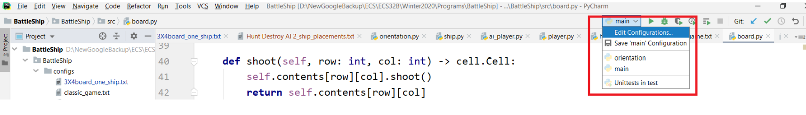
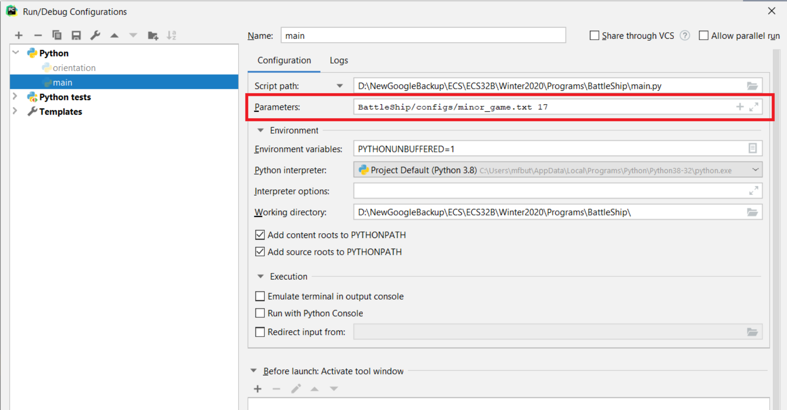

# Human-vs-AI-BattleShip

#### Goal
* Practice using classes, object oriented programing, and inheritance/multiple inheritance to solve a complex problem.

### Prerequisites
* PyCharm (Recommended)
  - [Download PyCharm](https://www.jetbrains.com/pycharm/download/#section=windows)
* Understanding for the game of BattleShip
  - If you have not played before, please play [this version](https://www.battleshiponline.org/) to gain familiarity with how the game works

## Running the tests

* First, download the zip into a desired directory on your device
* Next, the game configuration and random seed will be passed on the command line. To make them accessable to the program, you must use sys.argv and import the sys module. [This website](https://appdividend.com/2019/01/22/python-sys-argv-tutorial-command-line-arguments-example/) can be used to learn about how to use command line arguments. I will also explain below how to configure these arguments in PyCharm
  - First, to edit the command line argument in PyCharm click on your project and select Edit Configuration
  
  - Next, fill in the parameter fields with the command line parameters. Each parameter is separated by whitespace. If one of your parameters has whitespace enclose it in quotes
  
* The only other required step is to open the main.py file, and run the program. Player 1 will then be prompted to select their player type as either human, random AI, cheating AI, or search and destory AI. Each player type is defined as follows:
  - Human: Simply used to define a human player. Human players will manually chose where to place their ships on the board at the start of the game, and they will manually chose where to fire at each turn.
  - Random AI: Places ships on board in randomly chosen locations at start of game. Guesses coordinates to fire at randomly. 
  - Cheating AI: Places ships on board in randomly chosen locations at start of game. Plays a perfect game of BattleShip. It never misses and always hits its opponent's ships.
  - Search and Destory AI: Places ships in randomly chosen locations at start of game. When playing, operates in one of two modes: Search or Destroy. While in search mode, randomly guesses where to fire, just like the random AI. However, when it gets a hit, it switches to Destroy mode. In Destroy Mode, it will shoot to the left, above, right, and below the position that it hit. If it got any hits while doing this, it will repeat the process. Will switch back to Search Mode after it has finished shooting around all of the surroudning locations and hasn't found any more hits.
* Note about gameplay: 
  - Each player will have a placement board, and a scanning board. The placement board is the board that contains all of that players ships, and what the view of their board curretnly looks like. The scanning board is used to select where to fire at, and show the curent player all of the spots that they have either fired at and hit, fired at and missed, or have not yet fired at.

## Gameplay Sample
Enter one of ['Human', 'CheatingAi', 'SearchDestroyAi', 'RandomAi'] for Player 1's type: Human   
Player 1 please enter your name: Rick   
Rick's Placement Board   
  0 1 2 3 4 5   
0 * * * * * *   
1 * * * * * *  
2 * * * * * *  
3 * * * * * *  
4 * * * * * *  
  
Rick enter horizontal or vertical for the orientation of Patrol which is 2 long: hor  
Rick, enter the starting position for your Patrol ship ,which is 2 long, in the form row, column: 0,0  
Rick's Placement Board  
    0 1 2 3 4 5  
0 P P * * * *  
1 * * * * * *  
2 * * * * * *  
3 * * * * * *  
4 * * * * * *  
  
Rick enter horizontal or vertical for the orientation of Submarine which is 3 long: ver  
Rick, enter the starting position for your Submarine ship ,which is 3 long, in the form row, column: 5,2  
Cannot place Submarine vertically at 5, 2 because it would be out of bounds.  
Rick enter horizontal or vertical for the orientation of Submarine which is 3 long: hor  
Rick, enter the starting position for your Submarine ship ,which is 3 long, in the form row, column: 4,0  
Rick's Placement Board  
  0 1 2 3 4 5  
0 P P * * * *  
1 * * * * * *  
2 * * * * * *  
3 * * * * * *  
4 S S S * * *  
  
Enter one of ['Human', 'CheatingAi', 'SearchDestroyAi', 'RandomAi'] for Player 2's type: search  
Search Destroy AI 2's Placement Board  
  0 1 2 3 4 5  
0 * * * * * *  
1 * * * * * *  
2 * * * * * *  
3 * * * * * *  
4 * * * * * *  
  
Search Destroy AI 2's Placement Board  
  0 1 2 3 4 5  
0 * * * P * *  
1 * * * P * *  
2 * * * * * *  
3 * * * * * *  
4 * * * * * *  
  
Search Destroy AI 2's Placement Board  
  0 1 2 3 4 5  
0 * * * P * *  
1 * * * P * *  
2 * * S * * *  
3 * * S * * *  
4 * * S * * *  
  
Rick's Scanning Board  
  0 1 2 3 4 5  
0 * * * * * *  
1 * * * * * *  
2 * * * * * *  
3 * * * * * *  
4 * * * * * *  
  
Rick's Board  
  0 1 2 3 4 5  
0 P P * * * *  
1 * * * * * *  
2 * * * * * *  
3 * * * * * *  
4 S S S * * *  
  
Rick, enter the location you want to fire at in the form row, column: 0,0  
Miss  
Rick's Scanning Board  
  0 1 2 3 4 5  
0 O * * * * *  
1 * * * * * *  
2 * * * * * *  
3 * * * * * *  
4 * * * * * *  
  
Rik's Board  
  0 1 2 3 4 5  
0 P P * * * *  
1 * * * * * *  
2 * * * * * *  
3 * * * * * *  
4 S S S * * *  
  
Search Destroy AI 2's Scanning Board  
  0 1 2 3 4 5  
0 * * * * * *  
1 * * * * * *  
2 * * * * * *  
3 * * * * * *  
4 * * * * * *  
  
Search Destroy AI 2's Board  
  0 1 2 3 4 5  
0 O * * P * *  
1 * * * P * *  
2 * * S * * *  
3 * * S * * *  
4 * * S * * *  
  
Miss  
Search Destroy AI 2's Scanning Board  
  0 1 2 3 4 5  
0 * * * * * *  
1 * * O * * *  
2 * * * * * *  
3 * * * * * *  
4 * * * * * *  
  
Search Destroy AI 2's Board  
  0 1 2 3 4 5  
0 O * * P * *  
1 * * * P * *  
2 * * S * * *  
3 * * S * * *  
4 * * S * * *  
  
Rick's Scanning Board  
  0 1 2 3 4 5  
0 O * * * * *  
1 * * * * * *  
2 * * * * * *  
3 * * * * * *  
4 * * * * * *  
  
Rick's Board  
  0 1 2 3 4 5  
0 P P * * * *  
1 * * O * * *  
2 * * * * * *  
3 * * * * * *  
4 S S S * * *  
  
Rick, enter the location you want to fire at in the form row, column: 3,0  
Miss  
Rick's Scanning Board  
  0 1 2 3 4 5  
0 O * * * * *  
1 * * * * * *  
2 * * * * * *  
3 O * * * * *  
4 * * * * * *  
  
Rick's Board  
  0 1 2 3 4 5  
0 P P * * * *  
1 * * O * * *  
2 * * * * * *  
3 * * * * * *  
4 S S S * * *  
  
Search Destroy AI 2's Scanning Board  
  0 1 2 3 4 5  
0 * * * * * *  
1 * * O * * *  
2 * * * * * *  
3 * * * * * *  
4 * * * * * *  
  
Search Destroy AI 2's Board  
  0 1 2 3 4 5  
0 O * * P * *  
1 * * * P * *  
2 * * S * * *  
3 O * S * * *  
4 * * S * * *  
  
Miss  
Search Destroy AI 2's Scanning Board  
  0 1 2 3 4 5  
0 * * * * * *  
1 * * O * * *  
2 * * * * * O  
3 * * * * * *  
4 * * * * * *  
  
Search Destroy AI 2's Board  
  0 1 2 3 4 5  
0 O * * P * *  
1 * * * P * *  
2 * * S * * *  
3 O * S * * *  
4 * * S * * *  
  
Rick's Scanning Board  
  0 1 2 3 4 5  
0 O * * * * *  
1 * * * * * *  
2 * * * * * *  
3 O * * * * *  
4 * * * * * *  
  
Rick's Board  
  0 1 2 3 4 5  
0 P P * * * *  
1 * * O * * *  
2 * * * * * O  
3 * * * * * *  
4 S S S * * *  
  
Rick, enter the location you want to fire at in the form row, column: 3,1  
Miss  
Rick's Scanning Board  
  0 1 2 3 4 5  
0 O * * * * *  
1 * * * * * *  
2 * * * * * *  
3 O O * * * *  
4 * * * * * *  
  
Rick's Board  
  0 1 2 3 4 5  
0 P P * * * *  
1 * * O * * *  
2 * * * * * O  
3 * * * * * *  
4 S S S * * *  
  
Search Destroy AI 2's Scanning Board  
  0 1 2 3 4 5  
0 * * * * * *  
1 * * O * * *  
2 * * * * * O  
3 * * * * * *  
4 * * * * * *  
  
Search Destroy AI 2's Board  
  0 1 2 3 4 5  
0 O * * P * *  
1 * * * P * *  
2 * * S * * *  
3 O O S * * *  
4 * * S * * *  
  
Miss  
Search Destroy AI 2's Scanning Board  
  0 1 2 3 4 5  
0 * * * * * *  
1 * * O * * *  
2 * O * * * O  
3 * * * * * *  
4 * * * * * *  
  
Search Destroy AI 2's Board  
  0 1 2 3 4 5  
0 O * * P * *  
1 * * * P * *  
2 * * S * * *  
3 O O S * * *  
4 * * S * * *  
  
Rick's Scanning Board  
  0 1 2 3 4 5  
0 O * * * * *  
1 * * * * * *  
2 * * * * * *  
3 O O * * * *  
4 * * * * * *  
  
Rick's Board  
  0 1 2 3 4 5  
0 P P * * * *  
1 * * O * * *  
2 * O * * * O  
3 * * * * * *  
4 S S S * * *  
  
Rick, enter the location you want to fire at in the form row, column: 2,2  
You hit Search Destroy AI 2's Submarine!  
Rick's Scanning Board  
  0 1 2 3 4 5  
0 O * * * * *  
1 * * * * * *  
2 * * X * * *  
3 O O * * * *  
4 * * * * * *  
  
Rick's Board  
  0 1 2 3 4 5  
0 P P * * * *  
1 * * O * * *  
2 * O * * * O  
3 * * * * * *  
4 S S S * * *  
  
Search Destroy AI 2's Scanning Board  
  0 1 2 3 4 5  
0 * * * * * *  
1 * * O * * *  
2 * O * * * O  
3 * * * * * *  
4 * * * * * *  
  
Search Destroy AI 2's Board  
  0 1 2 3 4 5  
0 O * * P * *  
1 * * * P * *  
2 * * X * * *  
3 O O S * * *  
4 * * S * * *  
  
Miss  
Search Destroy AI 2's Scanning Board  
  0 1 2 3 4 5  
0 * * * * * *  
1 * * O * * *  
2 * O O * * O  
3 * * * * * *  
4 * * * * * *  
  
Search Destroy AI 2's Board  
  0 1 2 3 4 5  
0 O * * P * *  
1 * * * P * *  
2 * * X * * *  
3 O O S * * *  
4 * * S * * *  
  
Rick's Scanning Board  
  0 1 2 3 4 5  
0 O * * * * *  
1 * * * * * *  
2 * * X * * *  
3 O O * * * *  
4 * * * * * *  
  
Rick's Board  
  0 1 2 3 4 5  
0 P P * * * *  
1 * * O * * *  
2 * O O * * O  
3 * * * * * *  
4 S S S * * *  
  
Rick, enter the location you want to fire at in the form row, column: 3,2  
You hit Search Destroy AI 2's Submarine!  
Rick's Scanning Board  
  0 1 2 3 4 5  
0 O * * * * *  
1 * * * * * *  
2 * * X * * *  
3 O O X * * *  
4 * * * * * *  
  
Rick's Board  
  0 1 2 3 4 5  
0 P P * * * *  
1 * * O * * *  
2 * O O * * O  
3 * * * * * *  
4 S S S * * *  
  
Search Destroy AI 2's Scanning Board  
  0 1 2 3 4 5  
0 * * * * * *  
1 * * O * * *  
2 * O O * * O  
3 * * * * * *  
4 * * * * * *  
  
Search Destroy AI 2's Board  
  0 1 2 3 4 5  
0 O * * P * *  
1 * * * P * *  
2 * * X * * *  
3 O O X * * *  
4 * * S * * *  
  
Miss  
Search Destroy AI 2's Scanning Board  
  0 1 2 3 4 5  
0 * * * * * *  
1 * * O * * *  
2 * O O * * O  
3 * * * * * O  
4 * * * * * *  
  
Search Destroy AI 2's Board  
  0 1 2 3 4 5  
0 O * * P * *  
1 * * * P * *  
2 * * X * * *  
3 O O X * * *  
4 * * S * * *  
  
Rick's Scanning Board  
  0 1 2 3 4 5  
0 O * * * * *  
1 * * * * * *  
2 * * X * * *  
3 O O X * * *  
4 * * * * * *  
  
Rick's Board  
  0 1 2 3 4 5  
0 P P * * * *  
1 * * O * * *  
2 * O O * * O  
3 * * * * * O  
4 S S S * * *  
  
Rick, enter the location you want to fire at in the form row, column: 4,2  
You hit Search Destroy AI 2's Submarine!  
You destroyed Search Destroy AI 2's Submarine  
Rick's Scanning Board  
  0 1 2 3 4 5  
0 O * * * * *  
1 * * * * * *  
2 * * X * * *  
3 O O X * * *  
4 * * X * * *  
  
Rick's Board  
  0 1 2 3 4 5  
0 P P * * * *  
1 * * O * * *  
2 * O O * * O  
3 * * * * * O  
4 S S S * * *  
  
Search Destroy AI 2's Scanning Board  
  0 1 2 3 4 5  
0 * * * * * *  
1 * * O * * *  
2 * O O * * O  
3 * * * * * O  
4 * * * * * *  
  
Search Destroy AI 2's Board  
  0 1 2 3 4 5  
0 O * * P * *  
1 * * * P * *  
2 * * X * * *  
3 O O X * * *  
4 * * X * * *  
  
You hit Rick's Patrol!  
Search Destroy AI 2's Scanning Board  
  0 1 2 3 4 5  
0 * X * * * *  
1 * * O * * *  
2 * O O * * O  
3 * * * * * O  
4 * * * * * *  
  
Search Destroy AI 2's Board  
  0 1 2 3 4 5  
0 O * * P * *  
1 * * * P * *  
2 * * X * * *  
3 O O X * * *  
4 * * X * * *  
  
Rick's Scanning Board  
  0 1 2 3 4 5  
0 O * * * * *  
1 * * * * * *  
2 * * X * * *  
3 O O X * * *  
4 * * X * * *  
  
Rick's Board  
  0 1 2 3 4 5  
0 P X * * * *  
1 * * O * * *  
2 * O O * * O  
3 * * * * * O  
4 S S S * * *  
  
Rick, enter the location you want to fire at in the form row, column: 0,3  
You hit Search Destroy AI 2's Patrol!  
Rick's Scanning Board  
  0 1 2 3 4 5  
0 O * * X * *  
1 * * * * * *  
2 * * X * * *  
3 O O X * * *  
4 * * X * * *  
  
Rick's Board  
  0 1 2 3 4 5  
0 P X * * * *  
1 * * O * * *  
2 * O O * * O  
3 * * * * * O  
4 S S S * * *  
  
Search Destroy AI 2's Scanning Board  
  0 1 2 3 4 5  
0 * X * * * *  
1 * * O * * *  
2 * O O * * O  
3 * * * * * O  
4 * * * * * *  
  
Search Destroy AI 2's Board  
  0 1 2 3 4 5  
0 O * * X * *  
1 * * * P * *  
2 * * X * * *  
3 O O X * * *  
4 * * X * * *  
  
You hit Rick's Patrol!  
You destroyed Rick's Patrol  
Search Destroy AI 2's Scanning Board  
  0 1 2 3 4 5  
0 X X * * * *  
1 * * O * * *  
2 * O O * * O  
3 * * * * * O  
4 * * * * * *  

Search Destroy AI 2's Board  
  0 1 2 3 4 5  
0 O * * X * *  
1 * * * P * *  
2 * * X * * *  
3 O O X * * *  
4 * * X * * *  
  
Rick's Scanning Board  
  0 1 2 3 4 5  
0 O * * X * *  
1 * * * * * *  
2 * * X * * *  
3 O O X * * *  
4 * * X * * *  
  
Rick's Board  
  0 1 2 3 4 5  
0 X X * * * *  
1 * * O * * *  
2 * O O * * O  
3 * * * * * O  
4 S S S * * *  
  
Rick, enter the location you want to fire at in the form row, column: 1,3  
You hit Search Destroy AI 2's Patrol!  
You destroyed Search Destroy AI 2's Patrol  
Rick's Scanning Board  
  0 1 2 3 4 5  
0 O * * X * *  
1 * * * X * *  
2 * * X * * *  
3 O O X * * *  
4 * * X * * *  
  
Rick's Board  
  0 1 2 3 4 5  
0 X X * * * *  
1 * * O * * *  
2 * O O * * O  
3 * * * * * O  
4 S S S * * *  
  
Rick won the game!  
  
## Next Steps/Ideas
* Despite the game working as it should and serving as a way to play BattleShip, it is by no means pretty, or ideal for playing a game against someone. Simply using print statements to display the board was the best that I could do given my exclusively backend-related knowledge, but creating a user-friendly frontend for this game is definitely a next step that I would like to take. All the game mechanics that exist in the backend can still be used, then I could simply take out the print statements and use something like Javascript a nicer frontend. Frontend programming is a skill that I plan hope to build within the near future. 
## Author

* **William Schmidt** - [Wil's LikedIn](https://www.linkedin.com/in/william-schmidt-152431168/)
